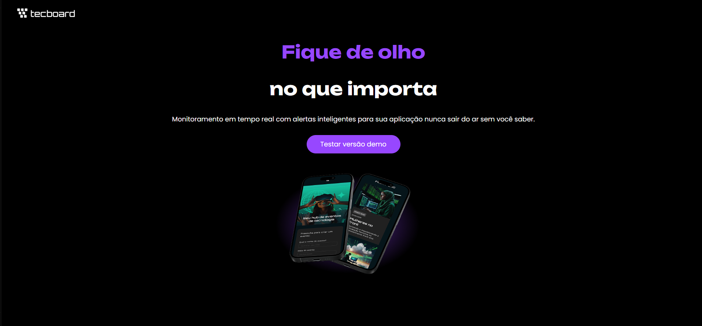

# 🚀 Tecboard

Landing page moderna e responsiva desenvolvida com HTML e CSS para apresentar uma plataforma fictícia de monitoramento em tempo real.

## 📌 Sobre o Projeto

O Tecboard é uma interface focada em monitoramento de aplicações, com uma proposta visual moderna e responsiva.

A página apresenta:
- headline principal
- descrição do serviço
- botão CTA (Call To Action)
- identidade visual moderna
- responsividade para desktop, tablet e mobile

---

## 🛠️ Tecnologias Utilizadas

- HTML5
- CSS3
- Google Fonts
- Media Queries (Responsividade)

---

## 📱 Responsividade

O projeto foi desenvolvido com responsividade para:

- 💻 Desktop
- 📱 Mobile
- 📲 Tablet

Utilizando:

```css
@media(max-width: 768px)
```

e

```css
@media(max-width: 375px)
```

---

## 📂 Estrutura do Projeto

```bash
Tecboard/
│
├── index.html
├── favicon-escuro.png
│
├── css/
│   └── style.css
│
├── imagens/
│   ├── logo-tecboard-claro.png
│   └── celuares-sobrepostos-desktop.png
```

---

## 🎯 Objetivo

Este projeto foi criado com foco em prática de:

- Estruturação HTML semântica
- Estilização com CSS
- Responsividade
- Organização de arquivos
- Landing pages modernas

---

## ▶️ Como Executar

Basta abrir o arquivo:

```bash
index.html
```

em qualquer navegador.

---

## 📸 Preview


---

## 👨‍💻 Autor

Desenvolvido por Henrique Hideki.
